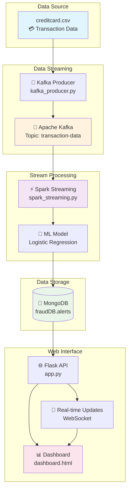

# 🚨 Real-Time Fraud Detection System

Bu proje, kredi kartı işlemlerini gerçek zamanlı olarak analiz ederek fraud (sahtekar) işlemleri tespit eden kapsamlı bir sistemdir. Apache Kafka, Apache Spark, MongoDB ve Flask teknolojilerini kullanarak yüksek performanslı bir streaming analytics çözümü sunar.

## 🏗️ Sistem Mimarisi



## 🚀 Özellikler

### 📡 Real-Time Processing
- **Kafka Streaming**: Yüksek throughput ile transaction verileri
- **Spark Streaming**: Mikro-batch işleme ile düşük latency
- **WebSocket**: Anlık dashboard güncellemeleri

### 🤖 Machine Learning
- **Logistic Regression**: Eğitilmiş fraud detection modeli
- **Feature Engineering**: Normalleştirilmiş amount değerleri
- **Real-time Prediction**: Streaming veriler üzerinde anlık tahmin

### 📊 Interactive Dashboard
- **Live Statistics**: Gerçek zamanlı fraud sayıları
- **Visual Charts**: Trend analizi ve risk dağılımı
- **Alert System**: Yeni fraud'lar için anlık bildirimler
- **Responsive Design**: Modern, glassmorphism UI

## 🛠️ Teknoloji Stack'i

| Kategori | Teknoloji | Versiyon | Açıklama |
|----------|-----------|----------|----------|
| **Streaming** | Apache Kafka | 2.8+ | Message broker |
| **Processing** | Apache Spark | 3.4.1 | Stream processing |
| **Database** | MongoDB | 6.0+ | Document storage |
| **Backend** | Flask | 2.3.2 | Web framework |
| **Frontend** | Bootstrap 5 | 5.3.0 | UI framework |
| **Charts** | Chart.js | 3.9.1 | Data visualization |
| **Real-time** | Socket.IO | 4.7.2 | WebSocket communication |

## 📋 Kurulum

### 1. Sistem Gereksinimleri
```bash
# Java 8+ (Spark için gerekli)
java -version

# Python 3.8+
python --version

# MongoDB
mongod --version

# Apache Kafka (opsiyonel - Docker ile de çalışabilir)
```

### 2. Python Ortamı
```bash
# Virtual environment oluştur
python -m venv fraud_detection_env

# Aktifleştir (Windows)
fraud_detection_env\Scripts\activate

# Aktifleştir (Linux/Mac)
source fraud_detection_env/bin/activate

# Paketleri yükle
pip install -r requirements.txt
```

### 3. Kafka Kurulumu (Docker ile)
```bash
# Docker Compose ile Kafka başlat
docker-compose up -d kafka zookeeper

# Topic oluştur
docker exec -it kafka kafka-topics.sh \
  --create --topic transaction-data \
  --bootstrap-server localhost:9092 \
  --partitions 3 --replication-factor 1
```

### 4. MongoDB Kurulumu
```bash
# MongoDB başlat
sudo systemctl start mongod

# Database oluştur
mongo
> use fraudDB
> db.alerts.createIndex({"_id": -1})
> exit
```

## 🚀 Çalıştırma

### 1. Veri Hazırlığı
```bash
# creditcard.csv dosyasını data/ klasörüne yerleştir
mkdir data
# Kaggle'dan Credit Card Fraud Detection dataset'ini indir
```

### 2. ML Model Eğitimi
```bash
# Model eğitim scriptini çalıştır (ayrı bir script gerekli)
python train_model.py
# Model model/ klasörüne kaydedilecek
```

### 3. Servisleri Başlatma

**Terminal 1: Kafka Producer**
```bash
python kafka_producer.py
```

**Terminal 2: Spark Streaming**
```bash
python spark_streaming.py
```

**Terminal 3: Web Dashboard**
```bash
python app.py
```

### 4. Dashboard Erişimi
```
http://localhost:5000
```

## 📁 Proje Yapısı

```
fraud-detection-system/
│
├── 📄 kafka_producer.py      # Kafka veri üreticisi
├── 📄 spark_streaming.py     # Spark streaming uygulaması
├── 📄 app.py                 # Flask web uygulaması
├── 📄 dashboard.html         # Ana dashboard UI
├── 📄 requirements.txt       # Python bağımlılıkları
├── 📄 README.md             # Bu dosya
│
├── 📁 data/                 # Veri dosyaları
│   └── creditcard.csv       # Transaction dataset
│
├── 📁 model/               # ML modelleri
│   └── fraud_model/        # Eğitilmiş Spark ML modeli
│
├── 📁 templates/           # Flask templates
│   └── dashboard.html      # Dashboard template
│
└── 📁 static/             # Statik dosyalar (CSS, JS)
    ├── css/
    ├── js/
    └── img/
```

## 🔧 Konfigürasyon

### Kafka Ayarları
```python
# kafka_producer.py içinde
bootstrap_servers = 'localhost:9092'
topic_name = 'transaction-data'
```

### MongoDB Ayarları
```python
# app.py içinde
mongo_uri = "mongodb://localhost:27017/"
database_name = "fraudDB"
collection_name = "alerts"
```

### Spark Ayarları
```python
# spark_streaming.py içinde
app_name = "FraudDetectionStream"
kafka_servers = "localhost:9092"
model_path = "model/fraud_model"
```

## 📊 Dashboard Özellikleri

### Real-time Metrics
- **Toplam Fraud**: Sistemde tespit edilen toplam fraud sayısı
- **Son 24 Saat**: Günlük fraud trendi
- **Ortalama Tutar**: Normalleştirilmiş fraud tutarları
- **Canlı Sayaç**: Gerçek zamanlı fraud sayısı

### Visualizations
- **Trend Chart**: Son 7 günlük fraud grafiği
- **Risk Distribution**: Pie chart ile risk seviyelerinin dağılımı
- **Alert Table**: Detaylı fraud kayıtları tablosu

### Real-time Features
- **WebSocket Updates**: Anlık veri güncellemeleri
- **Push Notifications**: Yeni fraud'lar için bildirimler
- **Auto Refresh**: Otomatik sayfa yenileme

## 🔍 Performans Optimizasyonu

### Kafka Tuning
```properties
# server.properties
num.network.threads=8
num.io.threads=16
socket.send.buffer.bytes=102400
socket.receive.buffer.bytes=102400
```

### Spark Tuning
```python
spark.conf.set("spark.sql.streaming.checkpointLocation", "/tmp/checkpoint")
spark.conf.set("spark.serializer", "org.apache.spark.serializer.KryoSerializer")
spark.conf.set("spark.sql.adaptive.enabled", "true")
```

### MongoDB Indexing
```javascript
// MongoDB'de performans için index'ler
db.alerts.createIndex({"_id": -1})
db.alerts.createIndex({"prediction": 1})
db.alerts.createIndex({"Class": 1})
```

## 🧪 Test Etme

### Unit Tests
```bash
# Test dosyaları
python -m pytest tests/
```

### Load Testing
```bash
# Kafka producer load test
python tests/load_test_kafka.py

# Dashboard stress test
ab -n 1000 -c 10 http://localhost:5000/stats
```

## 🐛 Debugging

### Log Seviyelerini Ayarlama
```python
import logging
logging.basicConfig(level=logging.INFO)
```

### Kafka Consumer Debug
```bash
kafka-console-consumer.sh \
  --bootstrap-server localhost:9092 \
  --topic transaction-data \
  --from-beginning
```

### MongoDB Debug
```javascript
// MongoDB'de fraud kayıtlarını kontrol et
db.alerts.find().sort({_id: -1}).limit(5)
```


## 📜 Lisans

Bu proje MIT lisansı altında lisanslanmıştır. Detaylar için `LICENSE` dosyasına bakın.


## 📞 İletişim

- **Project Lead**: [GitHub Profile]
- **Issues**: GitHub Issues sayfasını kullanın
- **Discussions**: GitHub Discussions için hoş geldiniz

## 🔗 Useful Links

- [Apache Kafka Documentation](https://kafka.apache.org/documentation/)
- [Apache Spark Streaming Guide](https://spark.apache.org/docs/latest/streaming-programming-guide.html)
- [MongoDB Python Driver](https://pymongo.readthedocs.io/)
- [Flask Documentation](https://flask.palletsprojects.com/)
- [Socket.IO Documentation](https://socket.io/docs/)

---

⭐ **Bu projeyi beğendiyseniz star vermeyi unutmayın!**